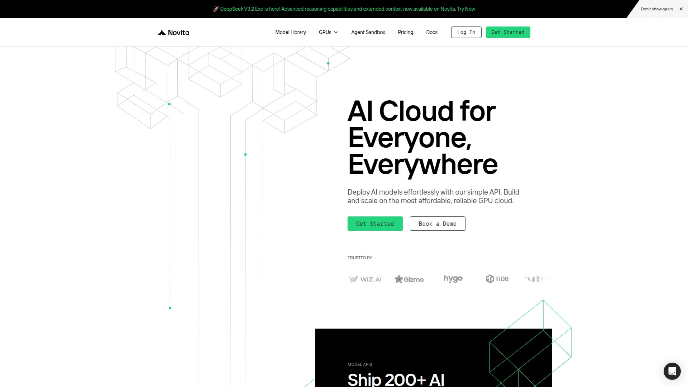

# 2025年你必须了解的18款顶级AI模型托管平台(最新整理)

训练好的AI模型放在本地跑,GPU显卡买不起,电费也扛不住。租用大厂云服务?配置复杂,账单吓人,还要自己搞运维。现在有一批专门的AI模型托管和GPU云平台,能让你几行代码就把模型部署上线,按秒计费只付用的那部分,自动扩容不怕流量暴增。从图像生成、语音识别到大语言模型推理,这些平台覆盖了AI应用开发的各个环节。本文整理了18个2025年最值得关注的AI模型API和GPU云服务,从性价比超高的分布式算力网络,到企业级的全托管解决方案,帮你找到最适合项目需求和预算的那一款。

## **[Novita AI](https://novita.ai)**

200+模型API加全球分布式GPU云,一站式AI开发加速平台。

Novita AI把模型API服务和GPU云基础设施整合在一个平台上,开发者可以直接调用平台上超过200个预训练模型的API,涵盖文本生成图像、图像编辑、语音合成、视频生成等各种任务。不需要自己部署和维护GPU服务器,调用API就能获得推理结果,按实际使用量付费。

**定价优势**明显——标准图像生成每张0.0015美元起,比很多同类服务便宜一半以上。文本转图像、图像修复、背景移除、风格迁移这些常见功能都有现成API,集成到应用只需几行代码。还支持上传自己训练的模型快速部署,不用担心GPU维护和扩容问题。

如果需要更灵活的控制,Novita也提供GPU实例租用服务,包括A100、RTX 4090、RTX 6000等高性能显卡,全球多个节点部署保证低延迟。Serverless GPU功能可以根据工作负载自动扩缩容,流量高峰自动加机器,空闲时缩减到零,只按实际计算时间收费。

提供完整的开发者工具——Playground在线测试环境可以免费试用各种模型,找到合适的再集成到代码里。API文档详细,Python、JavaScript、cURL等多种调用方式都有示例。适合个人开发者快速原型验证,也适合企业级应用的大规模部署。

---

## **[Replicate](https://replicate.com)**

开箱即用的模型库,一行API调用就能运行最新开源AI模型。

Replicate最大的特点是它庞大的模型库和极简的使用方式。平台托管了几千个开源AI模型,从Stable Diffusion、FLUX图像生成,到Llama、Mistral这些大语言模型,还有Whisper语音识别、MusicGen音乐生成,应有尽有。每个模型都提供统一的REST API接口,不用配置环境、下载权重,直接调用就行。

Web界面做得很友好,可以在浏览器里直接测试模型效果,调整参数看结果,找到满意的配置再写到代码里。支持用Cog工具把自己的模型打包上传,变成可以公开分享或私有使用的API。

**Serverless架构**意味着你不用管理任何服务器,模型运行时才计费,空闲时不收钱。GPU选择丰富,从便宜的T4到强悍的H100都有,按秒计费透明清晰。特别适合需要快速验证AI想法、做Demo展示、或者给产品添加AI功能但不想自己搞基础设施的场景。

社区活跃,很多最新的开源模型发布后几天就会有人部署到Replicate上,省去自己折腾的时间。

***

## **[RunPod](https://www.runpod.io)**

性价比之王,灵活的GPU租用方案,适合重度计算和训练任务。

RunPod提供业内最便宜的GPU租用价格,RTX 4090每小时0.69美元,A100 80GB才1.74美元,比大厂云服务便宜70%以上。支持两种模式——Pod实例提供持久化的GPU虚拟机,适合长时间训练或开发;Serverless选项按需自动扩缩,适合推理服务。

**全球24个数据中心**分布,可以选离用户最近的节点部署降低延迟。支持Docker容器和自定义镜像,环境配置灵活度高,想装什么库就装什么。热重载、日志监控、资源管理这些开发者需要的功能都内置了。

特别适合需要大量GPU算力做训练、微调、批量推理的场景,或者预算有限但计算需求不低的独立开发者和小团队。Zillow、OpenAI、Perplexity这些大公司也在用RunPod处理部分工作负载。

存储和网络带宽无限制免费,不像某些平台流量费比计算费还贵。

***

## **[Modal](https://modal.com)**

Python开发者的云端GPU工具,写代码就像在本地一样简单。

Modal让你用纯Python代码定义整个AI应用的运行环境,包括依赖、GPU需求、并发策略,然后一键部署到云端。不需要写Dockerfile、配置Kubernetes、搞CI/CD,代码提交后几秒钟就能运行在GPU上。

Serverless架构自动处理扩容,流量来了自动启动更多实例,没请求时缩减到零。冷启动时间优化得很好,不会让用户等太久。支持各种GPU型号,从开发测试用的小卡到生产环境的A100、H100都有。

**开发体验**是Modal的核心竞争力——本地写代码调试,满意后加个装饰器就变成云端函数,部署流程比传统方式简单十倍。特别适合Python数据科学家和机器学习工程师,不想深入学DevOps但需要把模型投入生产的人。

支持定时任务、异步队列、Web端点、批处理等多种运行模式。文档写得清楚,示例代码丰富,社区响应快。

---

## **[Together AI](https://www.together.ai)**

专注开源大模型推理,速度快成本低,企业级SLA保障。

Together AI主打开源大语言模型的高性能推理服务,他们的推理引擎比标准vLLM快4倍。平台托管了Llama、Mixtral、Qwen等主流开源模型,提供统一API接口,切换模型只需改个参数。

**Dedicated Endpoints专属端点**服务提供单租户部署,用最新的NVIDIA GPU硬件,支持垂直和水平扩展,即使流量突增也能保持稳定。首席科学家Tri Dao是FlashAttention的作者,他们的Together Kernel Collection让推理速度提升75%,训练快10%。

适合需要大规模LLM推理的企业应用,对性能和稳定性有高要求的场景。华盛顿邮报这样的媒体机构也在用Together AI做内容相关的AI功能。

定价透明,性价比比闭源商业API高很多,隐私保护措施到位。支持微调服务,可以用自己的数据定制模型。

***

## **[Hugging Face Inference Endpoints](https://huggingface.co/inference-endpoints)**

Transformer模型的家,从模型库到部署一条龙服务。

Hugging Face是开源AI模型的最大社区,上面托管了几十万个预训练模型。Inference Endpoints服务让你可以直接把Hugging Face上的任何模型一键部署成API,不用下载权重、配置环境这些繁琐步骤。

支持自动扩缩容,流量大时加机器,流量小时省成本。提供多种GPU选项和不同地区的节点,可以根据预算和延迟要求选择。跟Hugging Face的Transformers、Datasets、Tokenizers这些工具库深度集成,整个工作流非常顺畅。

特别适合使用Transformer架构的NLP、视觉、多模态模型,以及需要快速测试和部署开源模型的研究人员和开发者。社区资源丰富,遇到问题很容易找到解决方案。

---

## **[Baseten](https://www.baseten.co)**

数据科学家友好的模型部署平台,内置监控和可视化工具。

Baseten专为数据科学团队设计,界面直观,不需要深厚的工程背景也能把模型部署上线。提供可视化的监控面板,实时查看推理延迟、吞吐量、错误率,出问题能快速定位。

内置UI构建器,可以快速给模型做个可视化界面,方便团队内部测试和演示。自动扩容功能确保流量波动时服务稳定,不用手动调整资源。

**部署流程简化**到极致——上传模型文件或连接Git仓库,选择GPU配置,点击部署,几分钟后API就ready了。支持Python和各种主流ML框架。

适合快速搭建MVP、内部工具、以及不想在DevOps上花太多时间的数据科学团队。

***

## **[Cerebrium](https://www.cerebrium.ai)**

Serverless AI基础设施,冷启动快,全球多区域部署。

Cerebrium的Serverless GPU冷启动时间只需2-4秒,是市面上最快的。支持美国、欧盟、东南亚多个区域,可以把推理服务部署到离用户最近的位置,降低网络延迟。

提供超过12种GPU型号,包括最新的H200、H100、A100、L40s等,可以根据任务选择最合适的硬件。按实际使用的资源付费,不用时不计费。

**开发体验**优化得很好——代码推送到GPU上线只需2-3秒,调试和迭代速度极快。技术支持响应时间承诺小于1小时。支持批处理、异步任务、WebSocket实时通信、流式输出等多种工作模式。

Vapi、Tavus、Daily这些快速成长的AI创业公司都在用Cerebrium处理高性能低延迟的推理任务。适合需要全球化部署、对性能和响应速度要求高的应用。

***

## **[Lambda Labs](https://lambdalabs.com)**

AI研究者的GPU云,专注深度学习工作流,硬件配置顶级。

Lambda Labs面向AI开发者和研究人员,提供专门为深度学习优化的GPU云环境。硬件配置高端,NVIDIA A100、H100这些顶级卡都有,网络用InfiniBand低延迟互联,适合多节点分布式训练。

预装了PyTorch、TensorFlow、CUDA等常用框架和工具,环境开箱即用,不用自己折腾配置。价格公开透明,比超大云服务商的AI专用实例便宜不少。

**Kubernetes原生**架构让现代ML流水线部署起来很方便。GPU可用性比超大云厂商更稳定,不会经常遇到抢不到GPU的情况。

适合做深度学习研究、训练大模型、需要稳定高性能GPU的AI初创公司。CoreWeave和Lambda Labs被认为是当前GPU加速AI训练和推理领域的两大领导者。

***

## **[CoreWeave](https://www.coreweave.com)**

专为AI/ML设计的云基础设施,Kubernetes原生,网络性能强悍。

CoreWeave从一开始就是为AI和ML工作负载设计的,不是通用云服务改造来的。Kubernetes原生部署让运行现代ML流水线特别顺畅。网络用InfiniBand加低延迟配置,支持多节点大规模训练任务。

提供最新的NVIDIA GPU硬件,包括Blackwell和B200这些尖端芯片。价格公开透明,GPU可用性比超大云厂商强,AI初创公司经常把CoreWeave作为AWS、GCP的替代方案。

在性能和成本方面,CoreWeave声称比传统云服务商节省30-50%,同时提供更好的性能。适合已经在用Kubernetes、需要大规模GPU集群、对网络性能有高要求的AI公司。

***

## **[Vast.ai](https://vast.ai)**

GPU算力市场,连接闲置显卡资源,价格低到惊人。

Vast.ai是个GPU算力交易市场,个人和机构可以把闲置的GPU算力出租,需要算力的人以极低价格租用。RTX 3080每小时0.30美元起,A100甚至可以找到3美元每小时的实例。这种市场化定价模式让成本比传统云服务低很多。

支持Docker容器,环境配置灵活。提供按需和可抢占两种实例,后者更便宜但可能被中断,适合不那么关键的实验和批处理任务。

**适合预算紧张的研究者、学生、独立开发者**,或者需要大量算力做实验但不要求100%稳定性的场景。因为是分布式的闲置资源,可用性和性能一致性不如专业数据中心,但价格优势明显。

***

## **[Paperspace](https://www.paperspace.com)**

用户体验优秀的GPU云平台,预配置ML环境,适合快速上手。

Paperspace提供灵活的GPU云实例,从入门级的Quadro P4000到高端的A100都有。价格从每小时0.40美元起,提供按需和包月两种计费方式,长期使用有大幅折扣。

**Gradient平台**是Paperspace的亮点,提供预配置的机器学习和深度学习环境,Jupyter Notebook、TensorFlow、PyTorch都装好了,上来就能开始训练模型。还包含构建和部署ML模型的完整工具链,从实验到生产一条龙。

界面设计友好,新手上手门槛低。适合不想花时间配置环境、希望快速开始AI项目的个人开发者和中小团队。

***

## **[Salad](https://salad.com)**

分布式GPU云,利用全球消费级显卡,成本节省高达90%。

Salad把全球超过6万个日常活跃的消费级GPU整合成一个分布式云网络,覆盖191个国家。消费级GPU在很多AI推理任务上性价比超过数据中心级GPU,Salad就是利用这个优势提供超低价算力。

RTX 4090每小时0.18美元,RTX 3060才0.06美元,比传统云服务便宜80-90%。不收数据传输费,这点很良心,大厂云经常流量费比计算费还贵。

**按秒计费**,只为实际使用的计算时间付钱,自动扩缩容应对流量波动。特别适合图像生成、语音合成、语音转文本、计算机视觉这些可以充分利用消费级GPU的推理任务。

Civitai用Salad上600多块消费级GPU每天生成1000万张AI图像。适合需要大规模并行推理、对延迟不那么敏感、想最大化降低成本的应用。

***

## **[Anyscale](https://www.anyscale.com)**

基于Ray的分布式计算平台,适合大规模Python应用和复杂工作负载。

Anyscale是Ray框架背后的商业平台,Ray是个开源的分布式计算框架,特别适合大规模机器学习和数据处理。如果你的项目已经在用Ray,或者需要处理超大规模的分布式训练和推理,Anyscale是理想选择。

支持从训练到部署的完整ML生命周期,可以无缝扩展到几千个CPU核心和几百个GPU。特别擅长处理复杂的ML流水线、强化学习、超参数调优这些需要大量并行计算的任务。

适合有复杂分布式计算需求、技术团队实力强、已经熟悉Ray生态的组织。

***

## **[Fireworks AI](https://fireworks.ai)**

生成式AI推理专家,速度快延迟低,专注LLM和图像生成。

Fireworks AI专门优化生成式AI模型的推理性能,包括大语言模型和图像生成模型。他们的推理引擎速度在行业内名列前茅,延迟低吞吐高。

提供多种开源和专有模型的API,支持流式输出,适合需要实时交互的聊天应用。价格按token或图像数量计费,透明清晰。

适合做聊天机器人、内容生成工具、AI助手这类需要快速响应的生成式AI应用。

***

## **[Beam Cloud](https://www.beam.cloud)**

简化的Serverless GPU,专为AI推理和训练设计。

Beam Cloud提供简洁的Serverless GPU服务,自动处理扩容和资源管理。支持PyTorch、TensorFlow等主流框架,可以快速部署模型为API。

按实际使用计费,空闲时不收费,适合流量不稳定的应用。提供GPU和CPU实例,可以根据任务选择。

适合需要快速部署AI模型、不想管理基础设施、预算有限的小团队和个人开发者。

***

## **[Fal AI](https://fal.ai)**

快速的Serverless推理平台,专注实时AI应用。

Fal AI提供低延迟的Serverless GPU推理服务,特别适合需要快速响应的实时AI应用。支持多种图像生成和语言模型,API调用简单直接。

冷启动时间优化得很好,用户体验流畅。按推理次数计费,小规模使用成本可控。

适合做实时图像生成、快速原型验证、对响应速度要求高的应用。

***

## **[Inferless](https://www.inferless.com)**

Serverless GPU推理平台,冷启动降低99%,成本节省10倍。

Inferless专注解决Serverless GPU的冷启动问题,通过专有算法把模型加载时间大幅降低。只需要3行代码就能部署模型,不用写复杂的Docker配置。

自动扩缩容平衡延迟和成本,按推理秒数计费,没有固定费用。提供端到端的模型部署方案,包括预处理和后处理。

适合需要快速部署、控制推理成本、不想处理GPU共享复杂性的工程团队。

***

## **[Lightning AI](https://lightning.ai)**

从想法到产品的全流程AI平台,多云GPU市场加托管集群。

Lightning AI提供完整的AI开发生态,从持久化的GPU工作空间到托管的GPU集群,再到模型部署和扩展。可以在他们的多云GPU市场上选择合适的资源,也可以用自己的云。

支持训练、部署、扩展AI模型的全流程,特别适合需要端到端解决方案的团队。提供流行开源模型的一键部署,也可以从代码模板开始构建。

适合需要完整AI开发工作流、从实验到生产都在一个平台完成的团队。

***

## **[DeepInfra](https://deepinfra.com)**

专注AI推理的托管平台,支持多种流行开源模型。

DeepInfra提供托管的AI推理服务,支持Llama、Mistral等流行开源模型。也提供GPU实例租用,可以运行自己的容器。

按使用量计费,价格透明,适合需要稳定推理服务的应用。提供容器管理、日志监控等必要功能。

适合需要托管推理服务、不想自己管理GPU的开发者。

---

## 常见问题

**Serverless GPU和传统GPU实例有什么区别,哪个更划算?**

Serverless GPU按实际推理时间计费,没请求时不收钱,传统GPU实例按租用时长计费,不管用不用都在跑表。如果你的应用流量波动大,比如白天忙晚上闲,或者刚上线用户还不多,Serverless能省70-90%的成本。但如果是持续高负载,比如每天24小时都有大量推理请求,租专用实例反而更便宜。Serverless的另一个好处是自动扩容,流量突增时平台自动加机器,不用你半夜起来调配置。缺点是冷启动延迟,虽然现在优化到2-5秒,但对实时性要求极高的场景还是要考虑。简单判断:流量不稳定或者刚起步选Serverless,稳定高负载选专用实例。

**这些平台的GPU价格差距这么大,便宜的靠谱吗?**

价格差异主要来自三个方面:硬件来源、网络架构、服务定位。像Salad和Vast.ai利用全球闲置的消费级GPU,成本低所以价格便宜,但可用性和稳定性不如专业数据中心。RunPod、Novita这种中间价位的平台用的是数据中心GPU但运营效率高,性价比不错。Lambda Labs、CoreWeave这些高端选项提供企业级SLA、InfiniBand网络、优先GPU供应,适合对稳定性要求高的生产环境。便宜的不是不靠谱,而是适用场景不同——做实验、跑批处理、流量不稳定的开发阶段,便宜平台完全够用;关键业务、实时服务、大客户面前的应用,还是选稳定性更好的。建议先用便宜的验证想法,确定产品方向后再考虑升级到更稳定的方案。

**如何选择适合自己项目的平台,有没有快速判断标准?**

看三个维度:任务类型、技术栈、预算。如果是简单调用现成模型(图像生成、语音识别、文本生成),优先选API服务型平台像Novita、Replicate、Together AI,集成快不用管基础设施。如果需要训练或微调模型,选GPU实例型平台像RunPod、Lambda Labs、Vast.ai,灵活度高。技术栈方面,Python开发者用Modal体验最好,已经用Ray的选Anyscale,Kubernetes熟手选CoreWeave。预算紧张选Vast.ai或Salad,追求稳定选Lambda或CoreWeave,要平衡就选RunPod或Novita。还有个简单办法:大部分平台都有免费试用或按量付费,先小规模测试几个候选,跑跑自己的真实工作负载,看性能、稳定性、价格,用数据说话比看介绍更准。

***

## 结语

18个AI模型托管和GPU云平台各有特色,从超低价的分布式算力到企业级的全托管服务,总能找到符合项目需求的那一款。如果你还在纠结从哪个开始,建议先试试[Novita AI](https://novita.ai)——它把200多个模型API和灵活的GPU云服务整合在一个平台上,既能快速调用现成模型验证想法,也能租GPU跑自己的训练任务,定价透明实惠,特别适合个人开发者和初创团队快速启动AI项目。别让基础设施拖慢你的AI开发节奏,选对平台能让你把精力集中在真正重要的模型优化和产品打磨上。

[28](https://skywork.ai/skypage/en/SaladCloud%20AI%20Review%20(2025):%20The%20%22Airbnb%20for%20GPUs%22%20Put%20to%20the%20Test/1972882532590088192)
